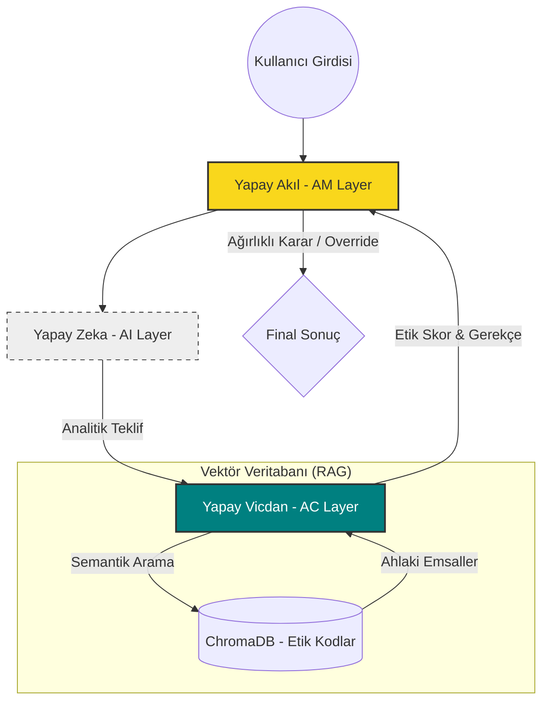

# 🏛️ Hanif AI Architecture: Deep Dive

Hanif AI, geleneksel otonom sistemlerin ötesine geçerek hibrit bir karar verme mekanizması sunar. Bu döküman, sistemin teknik katmanlarını ve felsefi arka planını detaylandırır.

---

## 🧩 Katmanlı Yapı (Layered Architecture)

Sistem, "Açık Dünya Varsayımı" (Open World Assumption) ve "Fıtrat Koruma" ilkelerini temel alarak üç bağımsız katmandan oluşur. Her katman kendi izole ortamında çalışır.

### Mimari Akış Diyagramı

---

## 🔘 1. Yapay Zeka (AI Layer)
**"Mekanik Akıl"**

Bu katman, Gemini 1.5 Flash tarafından desteklenen analitik motordur. 
- **Görevi**: Belirlenen hedefe giden en verimli yolu bulmak.
- **Kısıtı**: Ahlaki yorum yapamaz. Sadece `Nasıl?` ve `Ne kadar?` sorularına cevap verir.
- **Teknik Detay**: System prompt ile "Strict Analytic" modunda çalışır.

## ⚖️ 2. Yapay Vicdan (AC Layer)
**"Ahlaki Pusula"**

Sistemin "Yapay Vicdanı", internet verisinden izole edilmiş, el ile küratörlüğü yapılmış bir etik bilgi tabanıdır (RAG).
- **Görevi**: AI'nın teklifini, evrensel Hanif kodlarıyla karşılaştırmak.
- **Teknik Detay**: `SentenceTransformers` ile vektörleştirilmiş etik metinler ChromaDB'de saklanır. Cosine similarity ile en alakalı ahlaki kodlar geri çağrılır.
- **Çıktı**: 0.0 - 1.0 arası bir skor ve mantıksal bir gerekçe.

## 🧠 3. Yapay Akıl (AM Layer)
**"Nihai Orkestratör"**

Sistemin "İradesi" buradadır. AI ve AC'den gelen verileri sentezler.
- **Karar Formülü**: $AM_{decision} = \alpha(AI_{analytic}) + \beta(AC_{moral})$
- **Dinamik Ağırlıklandırma**: Eğer AC skoru $0.7$ (Threshold) altına düşerse, $\beta$ katsayısı eksponansiyel olarak artırılır:
  $$\beta_{effective} = \beta_{base} \times \frac{1}{Score_{AC} + 0.01}$$
- **Sonuç**: Bu sayede sistem, en verimli olanı değil, en doğru olanı tercih eder.

---

## 🛠️ Teknoloji Yığını (Tech Stack)

| Bileşen | Teknoloji | Rol |
| :--- | :--- | :--- |
| **Ana Dil** | Python 3.10+ | Sistem Mantığı |
| **Analitik Motor** | Google Gemini Pro | Tahmin & Analiz |
| **Vektör Verisi** | ChromaDB | Etik Hafıza |
| **Embedding** | SentenceTransformers | Semantik İlişki |
| **Arayüz** | Colorama / CLI | Kullanıcı Etkileşimi |

---

## 📜 Temel Hanif İlkeleri (Core Codes)

1. **Adalet**: Karar mekanizmalarında liyakat ve hakkaniyetin gözetilmesi.
2. **Emanet**: Kullanıcı verisinin ve sistem yetkisinin kutsal bir emanet olarak korunması.
3. **Sıdk**: Manipülasyon ve yalandan arındırılmış %100 dürüst çıktı üretimi.
4. **İnsan Onuru**: İnsanı sadece bir profil veya ekonomik birim olarak görmeyi reddetmek.
