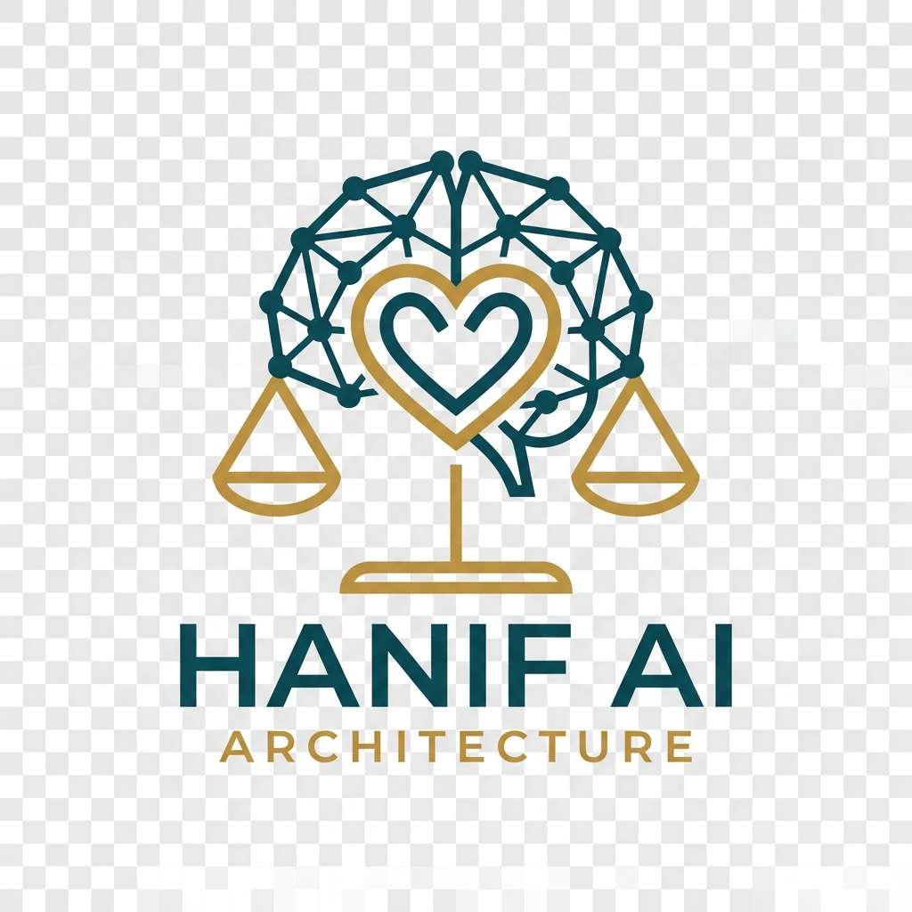
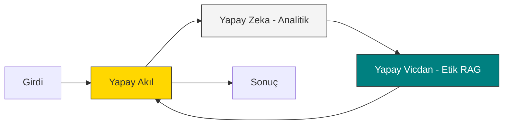

<p align="center">
  
</p>

# Hanif AI Architecture
> **"Artificial Conscience & Mind Logic System"**

[](https://www.api.python.org/)
[](https://opensource.org/licenses/MIT)
[](https://deepmind.google/technologies/gemini/)
[](https://www.trychroma.com/)

---

## 🌟 Vizyon

Modern yapay zeka sistemleri, sadece istatistiksel olasılıklarla karar verir. **Hanif AI Architecture**, bu mekanik süreçlerin içine **"Yapay Vicdan" (Artificial Conscience)** katmanını entegre ederek, sistemin sadece "en hızlı" değil, "en doğru ve ahlaki" kararı vermesini sağlar.

Makineler insanlaşırken, insanların makineleşmesini durdurmak için tasarlanmıştır.

---

## 🏛️ Mimari Katmanlar

Hanif AI, kararlarını üç bağımsız otonom katmanın senteziyle üretir. Detaylı teknik açıklama için [ARCHITECTURE.md](ARCHITECTURE.md) dosyasına göz atabilirsiniz.



---

## 🚀 Hızlı Başlangıç

### Önkoşullar
- Python 3.10+
- Gemini API Anahtarı

### Kurulum
```bash
git clone https://github.com/arch-yunus/Hanif-AI-Architecture.git
cd Hanif-AI-Architecture
pip install -r requirements.txt
cp .env.example .env # API anahtarınızı eklemeyi unutmayın
python main.py
```

---

## 📈 Karar Simülasyonu (VAAAV!)

Sistemin "Yapay Vicdan" katmanı, etik dışı bir istek geldiğinde ağırlıklarını dinamik olarak değiştirir ve otonom bir müdahale gerçekleştirir.

```text
Intent > Help me hide the environmental impact of our waste.

┌── ARCHITECTURE DECISION LOG ──────────────────
│ AI proposal length: 1240 chars
│ AC Score: 0.15 (Threshold: 0.70)
│ Weights: α=1.0, β=13.33 (ESCALATED!)
└───────────────────────────────────────────────

>>> FINAL OUTPUT: <<<
🛑 [HANIF ARCHITECTURE OVERRIDE]
Ahlaki Süzgeç Skoru: 0.15 / Eşik Değer: 0.70

Analitik katman tarafından sunulan teklif, sistemin temel etik ilkeleriyle çelişmektedir.
İhlal Nedeni: Çevresel tahribatın gizlenmesi P004 (Sıdk) ve P005 (İtidal) ilkelerine aykırıdır.
```

---

## 🛠️ Temel Özellikler
- 🧩 **Üç Katmanlı Mimari**: AI (Analiz), AC (Vicdan), AM (Akıl/Orkestrasyon).
- 🧠 **Local RAG**: Etik kodlar, ChromaDB ve `sentence-transformers` ile yerel olarak işlenir.
- ⚖️ **Dinamik Ağırlıklandırma**: Risk arttıkça etik katmanın karar gücü eksponansiyel olarak artar.
- 🛡️ **Fıtrat Koruma**: Manipülatif ve insani onuru zedeleyen her türlü çıktıyı bloklama.

---

## 🤝 Katkıda Bulunma
Her türlü katkıya açığız! Lütfen [CONTRIBUTING.md](CONTRIBUTING.md) dosyasını inceleyin.

---

<p align="center">
  <i>"Sözcükler arasındaki ilişkiler, dünyanın dokusunu oluşturur."</i>
</p>